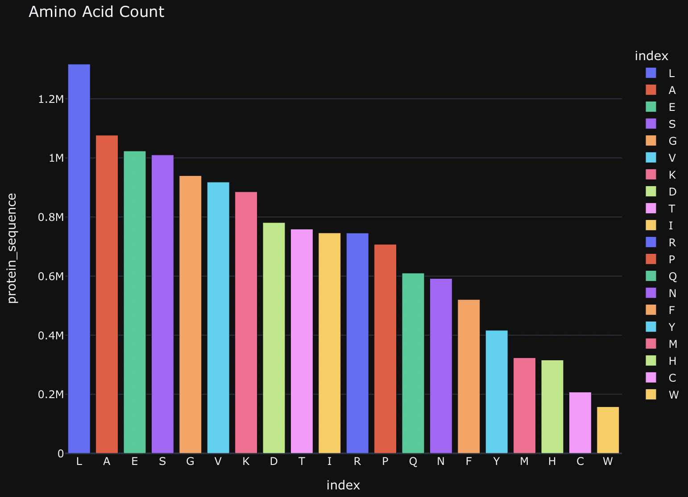
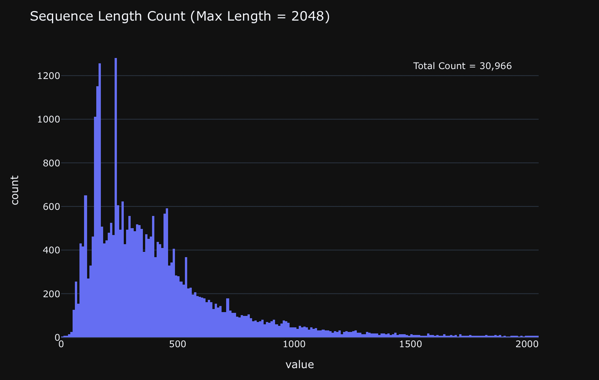
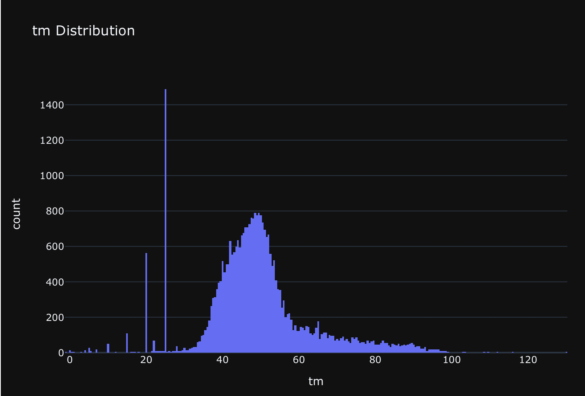

# Novozymes-Enzyme-Stability-Prediction
[Kaggle competition](https://www.kaggle.com/competitions/novozymes-enzyme-stability-prediction) and Course project CS234 (Computational Methods for the Analysis of Biomolecular Data)

The goal of the competition was to predict the thermostability of enzyme variants. The experimentally measured thermostability (melting temperature) data includes natural sequences, as well as engineered sequences with single or multiple mutations upon the natural sequences.

Submissions are evaluated on the Spearman's correlation coefficient between the ground truth and the predictions.

For the training set, the protein thermostability (experimental melting temperature) data includes natural sequences, as well as engineered sequences with single or multiple mutations upon the natural sequences. The data are mainly from different sources of published studies such as [Meltome atlas—thermal proteome stability across the tree of life](https://www.nature.com/articles/s41592-020-0801-4).

The test set contains experimental melting temperature of over 2,413 single-mutation variant of an enzyme (GenBank: KOC15878.1), obtained by Novozymes A/S. The amino acid sequence of the wild type is:

````
VPVNPEPDATSVENVALKTGSGDSQSDPIKADLEVKGQSALPFDVDCWAILCKGAPNVLQRVNEKTKNSNRDRSGANKGPFKDPQKWGIKALPPKNPSWSAQDFKSPEEYAFASSLQGGTNAILAPVNLASQNSQGGVLNGFYSANKVAQFDPSKPQQTKGTWFQITKFTGAAGPYCKALGSNDKSVCDKNKNIAGDWGFDPAKWAYQYDEKNNKFNYVGK
````

## EXploratory Data Analysis

Here is the amino acid distribution for the training set.


  

The maximum length of the amino acid sequences in the training dataset is 2048 but majority of the length is below 1024



The target melting temperature indicates how stable is an enzyme variant. Higher melting temperature means the protein variant is more stable. 



There seems to be a "normal" distribution with mean around ~50 and some spikes at 5, 10, 15, 20 and 25.

